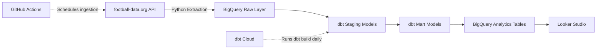
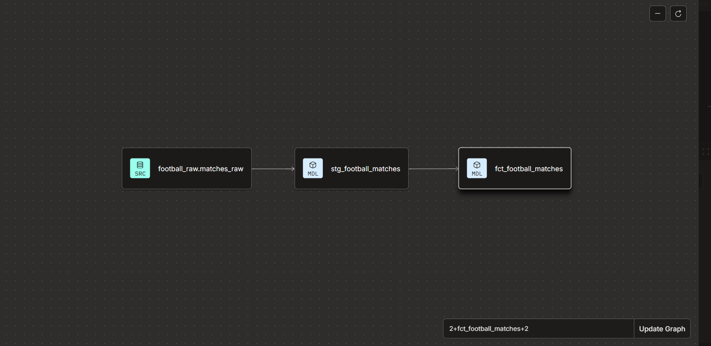
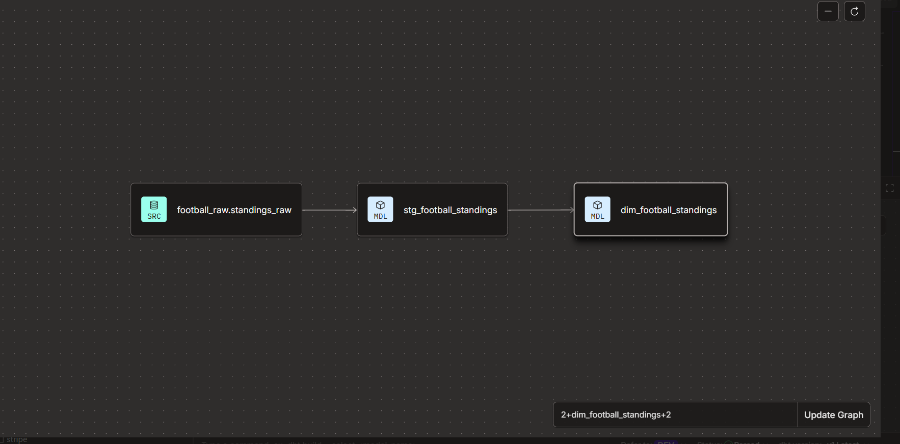
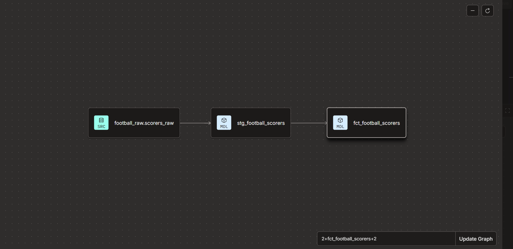

# EPL Data Pipeline

An end-to-end data engineering pipeline that ingests live English Premier League data from the football-data.org API, loads raw data into Google BigQuery, transforms and models it with dbt, and produces analytics-ready tables for downstream reporting in Looker Studio.

The project demonstrates a practical ELT architecture using API ingestion, cloud data warehousing, layered dbt modeling, historical standings tracking, automated data quality testing, and scheduled cloud orchestration.

---

## Why this project

Many portfolio projects stop at loading a CSV and running SQL queries.

This project was built to represent a more realistic data engineering workflow:

- Data is automatically extracted from an external REST API
- Raw API responses are preserved in BigQuery
- Transformation happens separately using dbt
- Staging models isolate source parsing and cleaning
- Mart models expose analytics-ready datasets
- Historical league standings are preserved instead of overwritten
- Data quality is validated through dbt tests and custom business-rule tests
- Ingestion and transformation are scheduled independently
- Final models are designed for downstream BI consumption

---

## Architecture



The overall data flow is:

```text
football-data.org API
        |
        v
Python Extraction
        |
        v
BigQuery Raw Layer
        |
        v
dbt Staging Models
        |
        v
dbt Mart Models
        |
        v
BigQuery Analytics Tables
        |
        v
Looker Studio
```

---

## Pipeline orchestration

The pipeline uses two schedulers with separate responsibilities.

### GitHub Actions

GitHub Actions handles the ingestion layer.

A scheduled workflow runs the Python extraction script, retrieves Premier League data from the football-data.org API, and loads the responses into BigQuery raw tables.

### dbt Cloud

dbt Cloud handles transformation and testing.

A scheduled dbt Cloud job runs:

```bash
dbt build
```

This builds the transformation models and executes their associated data quality tests.

Keeping ingestion and transformation orchestration separate also reflects a common architecture where ingestion and analytics engineering workflows have independent execution lifecycles.

---

## Data source

The project uses the football-data.org REST API.

The pipeline currently ingests:

- Premier League matches
- Premier League standings
- Premier League top scorers

Each API dataset is first stored in the BigQuery raw layer before being transformed.

Current raw sources include:

```text
football_raw.matches_raw
football_raw.standings_raw
football_raw.scorers_raw
```

---

## dbt modeling architecture

The dbt project follows a layered modeling structure:

```text
Source
  ↓
Staging
  ↓
Mart
```

The staging layer is responsible for parsing and cleaning the source data.

The mart layer contains business-ready models designed for analytics and reporting.

---

## dbt lineage

dbt manages dependencies between the BigQuery raw sources, staging models, and analytical marts through `source()` and `ref()` relationships.

### Match data

```text
football_raw.matches_raw
        ↓
stg_football_matches
        ↓
fct_football_matches
```



### Standings data

```text
football_raw.standings_raw
        ↓
stg_football_standings
        ↓
dim_football_standings
```



### Scorers data

```text
football_raw.scorers_raw
        ↓
stg_football_scorers
        ↓
fct_football_scorers
```



This keeps transformations modular and ensures mart models depend on staging models rather than querying raw tables directly.

---

## Data model

### Staging layer

The staging models flatten and standardize the raw football API data.

| Model | Description |
|---|---|
| `stg_football_matches` | Cleans and flattens Premier League match data |
| `stg_football_standings` | Cleans and flattens league standings snapshots |
| `stg_football_scorers` | Cleans and flattens player scoring data |

Source definitions are maintained in:

```text
models/staging/football/_src_football.yml
```

### Mart layer

The mart layer contains analytics-ready models for downstream reporting.

| Model | Description |
|---|---|
| `fct_football_matches` | Deduplicated match-level dataset containing teams, status, and match results |
| `dim_football_standings` | Historical standings dimension used to track changes in team position over time |
| `fct_football_scorers` | Player scoring dataset containing goals and ranking information |

---

## Historical standings modeling

League standings are snapshots rather than static records.

If each new league table simply replaced the previous one, historical information such as a team's position last week would be lost.

To avoid this, raw standings snapshots are retained in BigQuery.

The standings mart uses SQL window functions such as:

```sql
LAG()
LEAD()
```

to compare a team's position across successive snapshots.

This allows the model to derive movement indicators such as:

```text
UP
DOWN
POSITION_UNCHANGED
```

and effective-period fields such as:

```text
valid_from
valid_to
is_current
```

This provides SCD Type 2-style historical tracking while retaining the original snapshots in the raw layer.

---

## Data quality testing

Testing is integrated directly into the dbt project and runs as part of:

```bash
dbt build
```

The project uses both standard dbt tests and custom SQL business-rule tests.

### Staging model tests

#### `stg_football_matches`

The following fields are validated:

```text
match_id       → not_null
home_team_id   → not_null
away_team_id   → not_null
```

`match_status` is restricted using an `accepted_values` test to:

```text
SCHEDULED
TIMED
IN_PLAY
PAUSED
FINISHED
POSTPONED
SUSPENDED
CANCELLED
```

#### `stg_football_standings`

```text
team_id     → not_null
position    → not_null
```

#### `stg_football_scorers`

```text
player_id   → not_null
goals       → not_null
```

---

## Mart model tests

### `fct_football_matches`

```text
match_id       → unique
match_id       → not_null
home_team_id   → not_null
away_team_id   → not_null
```

The uniqueness test ensures each match appears only once in the analytical fact table.

### `dim_football_standings`

```text
team_id       → not_null
position      → not_null
valid_from    → not_null
```

### `fct_football_scorers`

```text
player_id    → not_null
goals        → not_null
```

---

## Custom business-rule tests

In addition to schema-level dbt tests, the project includes custom SQL tests for domain-specific rules.

### Goals cannot be negative

Completed match records should never contain negative goal values.

```sql
select *
from {{ ref('fct_football_matches') }}
where home_goals_full_time < 0
   or away_goals_full_time < 0
```

The test fails if any invalid match records are returned.

---

### League position must be between 1 and 20

The English Premier League contains 20 teams, so a valid standings position must fall within that range.

```sql
select *
from {{ ref('dim_football_standings') }}
where position < 1
   or position > 20
```

Any returned rows represent invalid standings records.

---

### Every standings team must exist in the match data

This test performs a cross-model referential integrity check between the standings dimension and match fact table.

```sql
select distinct s.team_id
from {{ ref('dim_football_standings') }} s

left join {{ ref('fct_football_matches') }} m
    on s.team_id = m.home_team_id
    or s.team_id = m.away_team_id

where m.home_team_id is null
```

The test ensures that teams appearing in the standings also appear in the match dataset.

This provides an additional validation layer beyond simple field-level checks.

---

## Design decisions and trade-offs

### Preserve raw API responses

Raw API data is stored before transformation rather than immediately flattening the source.

This provides:

- Source traceability
- Easier debugging
- Reprocessing capability
- Protection against losing fields that may become useful later
- Clear separation between ingestion and transformation

The staging layer therefore handles parsing and standardization while the raw layer remains close to the source.

---

### Staging models isolate source logic

Mart models do not query the raw API tables directly.

Instead, dependencies follow:

```text
Raw source
   ↓
Staging
   ↓
Mart
```

This makes source-specific parsing logic reusable and prevents downstream analytical models from becoming tightly coupled to the raw API structure.

---

### Full-refresh modeling

The project currently uses full-refresh table materializations instead of incremental `MERGE` strategies.

This decision was influenced by BigQuery free-tier limitations around DML operations without an attached billing account.

At the current data volume, rebuilding the analytical models remains inexpensive and operationally simple.

In a larger production environment, suitable models could instead use dbt incremental strategies such as:

```text
merge
insert_overwrite
```

alongside partitioning and clustering.

---

### Historical standings from accumulated snapshots

Rather than updating historical records through database-side `MERGE` operations, raw standings snapshots are accumulated over time.

dbt then reconstructs the historical timeline using SQL window functions.

For the current dataset size, this provides a transparent and cost-effective way to retain league history.

---

### Independent orchestration

The ingestion and transformation processes are scheduled separately:

```text
GitHub Actions → API ingestion
dbt Cloud      → Transformation + testing
```

This separation keeps responsibilities clear and makes failures easier to isolate.

---

## Tech stack

| Technology | Purpose |
|---|---|
| Python | API extraction and ingestion |
| football-data.org API | Premier League data source |
| Google BigQuery | Raw and analytical cloud data warehouse |
| dbt | SQL transformation, modeling, dependency management and testing |
| dbt Cloud | Scheduled transformation jobs |
| GitHub Actions | Scheduled extraction workflow |
| Git / GitHub | Version control and repository hosting |
| Looker Studio | BI and visualization layer |

---

## Repository structure

```text
epl-data-pipeline/
│
├── .github/
│   └── workflows/
│       └── run_pipeline.yml
│
├── extract/
│   ├── fetch_football_data.py
│   └── requirements.txt
│
├── dbt_project/
│   │
│   ├── analyses/
│   ├── macros/
│   │
│   ├── models/
│   │   │
│   │   ├── staging/
│   │   │   └── football/
│   │   │       ├── _src_football.yml
│   │   │       ├── stg_football_matches.sql
│   │   │       ├── stg_football_standings.sql
│   │   │       └── stg_football_scorers.sql
│   │   │
│   │   └── marts/
│   │       └── football/
│   │           ├── dim_football_standings.sql
│   │           ├── fct_football_matches.sql
│   │           └── fct_football_scorers.sql
│   │
│   ├── seeds/
│   ├── snapshots/
│   ├── tests/
│   ├── dbt_project.yml
│   ├── packages.yml
│   └── package-lock.yml
│
├── docs/
│   └── images/
│       ├── matches_lineage.png
│       ├── standings_lineage.png
│       └── scorers_lineage.png
│
├── .gitignore
└── README.md
```

---

## Dashboard

A Looker Studio dashboard will consume the final mart models for Premier League analysis.

Planned reporting includes:

- Current Premier League standings
- League position movement
- Match results
- Team performance
- Goals scored and conceded
- Top scorers
- Player goals
- Historical league-position trends

**Dashboard:** Coming soon

---

## Future improvements

Potential extensions to the project include:

- Introduce incremental dbt models when billing-enabled BigQuery DML is available
- Partition large fact tables by match date
- Cluster frequently filtered fields
- Add dbt source freshness monitoring
- Publish dbt documentation and lineage
- Add automated pipeline failure notifications
- Introduce CI checks for pull requests
- Load additional Premier League seasons
- Extend the pipeline to other football competitions
- Add richer player and team dimensions
- Add automated dashboard refresh validation

---

## Key concepts demonstrated

This project demonstrates practical experience with:

- ELT pipeline architecture
- REST API ingestion
- Python data extraction
- Cloud data warehousing
- BigQuery
- Raw / staging / mart modeling
- dbt dependency management
- Fact and dimension modeling
- Historical data modeling
- SCD Type 2 concepts
- SQL window functions
- Data quality testing
- Custom business-rule validation
- Referential integrity testing
- Cloud scheduling
- Git-based development
- Analytics engineering
- BI-ready data modeling
